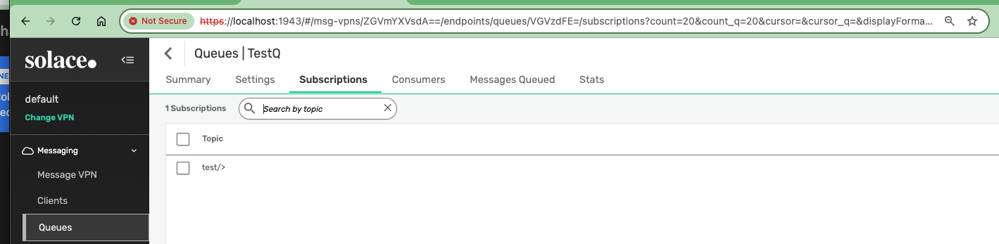

# Solace Prometheus Exporter demo setup

Docker-compose to spin up and configure required services to demo [Solace Prometheus Exporter](https://github.com/swayvil/solace-prometheus-exporter)

### 1. Solace broker 
- This loads a standard edition by default. Update the docker-compose if you would like to run a different version such as enterprise edition. You are responsible for loading the image.
- A self-signed server cert (server.pem) is available. If you have custom cert from CA, add it under solace/certs folder.
- server cert must be installed on the broker with Solace CLI. (password for server.pem is solace1)
- Only few essential ports like SEMP, SMF are open. If you require more ports (eg: MQTT), add them under the ports section for solace
- Default admin password is admin

### 2. Solace Prometheus Exporter
- Self signed cert and keys are loaded by default. Add custom certs under exporter/certs folder and change the config accordingly

### 3. Prometheus
- Only one broker (the one spun up here) is monitored. Add more entries in ./prometheus/prometheus.yml as required.

### 4. Grafana
- Default admin password is admin. Change on login.
- Prometheus is configured as datasource already. Add additional data sources as required.
- Some [sample dashboards](https://github.com/swayvil/solace-prometheus-exporter/tree/master/grafana) are loaded already under the folder Solace/. Add any additional custom dashboards as required.

# Running

```
▶ docker-compose up -d
[+] Running 39/18
 ✔ alpine                  Pulled      13.2s
 ✔ prometheus              Pulled      22.2s
 ✔ solace-exporter         Pulled      1.7s
 ✔ solace-10               Pulled      41.5s
 ✔ grafana                 Pulled      18.2s

[+] Running 7/7
 ✔ Network solace-prometheus-exporter_poc-net        Created     0.1s
 ✔ Volume "solace-prometheus-exporter_grafana-data"  Created     0.0s
 ✔ Container alpine                                  Started     2.9s
 ✔ Container prometheus                              Started     2.9s
 ✔ Container solace-10                               Started     3.0s
 ✔ Container solace-exporter                         Started     0.7s
 ✔ Container grafana                                 Started
```
### Check services are running

```
▶ docker-compose ps
NAME              IMAGE                                        COMMAND                  SERVICE           CREATED          STATUS          PORTS
alpine            alpine:latest                                "/bin/sh -c 'apk add…"   alpine            49 seconds ago   Up 46 seconds
grafana           grafana/grafana:latest                       "/run.sh"                grafana           46 seconds ago   Up 45 seconds   0.0.0.0:3000->3000/tcp
prometheus        prom/prometheus:latest                       "/bin/prometheus --c…"   prometheus        49 seconds ago   Up 46 seconds   0.0.0.0:9090->9090/tcp
solace-10         solace/solace-pubsub-standard                "/usr/sbin/boot.sh"      solace-10         49 seconds ago   Up 46 seconds   0.0.0.0:1443->1443/tcp, 0.0.0.0:1943->1943/tcp, 0.0.0.0:8008->8008/tcp, 0.0.0.0:55443->55443/tcp, 0.0.0.0:8088->8080/tcp, 0.0.0.0:55333->55555/tcp
solace-exporter   solacecommunity/solace-prometheus-exporter   "/solace_prometheus_…"   solace-exporter   46 seconds ago   Up 45 seconds   0.0.0.0:9628->9628/tcp
```

### Setup Solace Server certificate

```
▶ docker exec -it solace-10 cli

solace-10> en
solace-10# configure
solace-10(configure)# ssl
solace-10(configure/ssl)# server-certificate server.pem
Enter private key pass phrase: solace1 is the password
solace-10(configure/ssl)# show ssl server-certificate
Filename:             server.pem
Configured at:        Oct 15 2024 23:43:22 UTC
```

### Setup Solace Queues, etc
This step is optional. You can use Solace CLI, WebUI or the script setup-solace.sh from alpine shell.

```
▶ docker exec -it alpine sh

~ # sh /app/scripts/setup-solace.sh
Wed Oct 16 01:47:01 UTC 2024: setup-solace.sh Creating objects in Solace
SOLACE_URL: https://solace-10:1943
SEMP_USERNAME: admin

 Setting up Queues

Wed Oct 16 01:47:01 UTC 2024: Processing Queue file: /app/scripts/SEMP/default/queues/TestQ/queue.json (URL: default/queues)
{"data":{"accessType":"exclusive","consumerAckPropagationEnabled":true,"deadMsgQueue":"#DEAD_MSG_QUEUE","deliveryCountEnabled":false,"deliveryDelay":0,"egressEnabled":true,"eventBindCountThreshold":{"clearPercent":60,"setPercent":80},"eventMsgSpoolUsageThreshold":{"clearPercent":18,"setPercent":25},"eventRejectLowPriorityMsgLimitThreshold":{"clearPercent":60,"setPercent":80},"ingressEnabled":true,"maxBindCount":1000,"maxDeliveredUnackedMsgsPerFlow":10000,"maxMsgSize":10000000,"maxMsgSpoolUsage":5000,"maxRedeliveryCount":0,"maxTtl":0,"msgVpnName":"default","owner":"default","partitionCount":0,"partitionRebalanceDelay":5,"partitionRebalanceMaxHandoffTime":3,"permission":"no-access","queueName":"TestQ","redeliveryDelayEnabled":false,"redeliveryDelayInitialInterval":1000,"redeliveryDelayMaxInterval":64000,"redeliveryDelayMultiplier":200,"redeliveryEnabled":true,"rejectLowPriorityMsgEnabled":false,"rejectLowPriorityMsgLimit":0,"rejectMsgToSenderOnDiscardBehavior":"when-queue-enabled","respectMsgPriorityEnabled":false,"respectTtlEnabled":false},"links":{"subscriptionsUri":"https://solace-10:1943/SEMP/v2/config/msgVpns/default/queues/TestQ/subscriptions","uri":"https://solace-10:1943/SEMP/v2/config/msgVpns/default/queues/TestQ"},"meta":{"request":{"method":"POST","uri":"https://solace-10:1943/SEMP/v2/config/msgVpns/default/queues"},"responseCode":200}}
 
 Setting up Queue subscriptions

Wed Oct 16 01:47:01 UTC 2024: Processing Q Subscription file: /app/scripts/SEMP/default/queues/TestQ/subscriptions.json (URL: default/queues/TestQ/subscriptions)
{"data":{"msgVpnName":"default","queueName":"TestQ","subscriptionTopic":"test/>"},"links":{"uri":"https://solace-10:1943/SEMP/v2/config/msgVpns/default/queues/TestQ/subscriptions/test%2F%3E"},"meta":{"request":{"method":"POST","uri":"https://solace-10:1943/SEMP/v2/config/msgVpns/default/queues/TestQ/subscriptions"},"responseCode":200}}
Wed Oct 16 01:47:01 UTC 2024: setup-solace.sh Exiting
```


# Verification

## Check broker 
 https://localhost:1943/
 


 ## Check the Solace exporter
 https://localhost:9628/


## Check Prometheus
http://localhost:9090/


## Check Grafana
http://localhost:3000/

Note: Recreate the variable instance and vpn_name if it doesn't pull in values.

### Broker Stats


### VPN Stats

